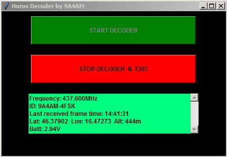

# HORUS-portable-decoder
HORUS portable decoder is based on Raspberry Pi (I use RPi3+) and LCD3.5" shield. Radio is RTL-SDR.  GUI is realized with Tkinter - Python3. Data for GUI use log file Horusdemodlib. For use in portable, Rpi is powered with PowerBank. Second part is RX Frequency Editor for Horusdemodlib. Editor edited start script (start_rtlsdr.sh) read frequency data and if click(tap) on textbox open numeric keyboard for enter new RX frequency(input must be number and 9 digit - in Hz), after change press SAVE to store new frequency in start script. 

