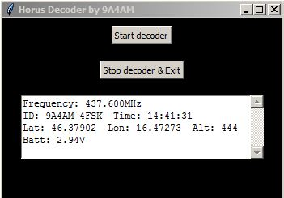

# HORUS-portable-decoder
HORUS portable decoder is based on Raspberry Pi (I use RPi3+) and LCD3.5" shield. Radio is RTL-SDR.  GUI is realized with Tkinter - Python3. Data for GUI use log file Horusdemodlib. In portable, Rpi is powered with PowerBank.

